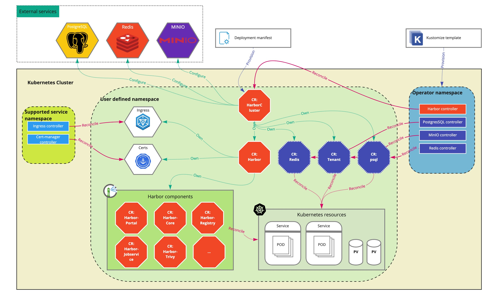

# How it works

## Overall design

The diagram shown below describes the overall design of the Harbor operator day1 functionalities.

Besides, the Harbor operator controllers, the `PostgreSQL`, `MinIO` and `Redis` controllers might be also needed when you want to deploy a full stack Harbor cluster in a scalable and HA way. An 'all-in-one' kustomization YAML template is provided for the user to easily deploy all the controllers at once in a simple way.

Harbor operator leverages the ingress to expose the accessible frontend service, and the cert-manager to populate the related required certificates. Therefore, the ingress controller and cert-manager controller should be pre-deployed by the user before operating the Harbor cluster as they're not contained in any Harbor operator deploying packages.

A top level CR `HarborCluster` is introduced to hold the whole component stack of the deploying Harbor cluster. The Harbor cluster owns the Harbor registry itself that is represented by the `Harbor` CR as well as the possible related dependent services including 'postgresql', 'Minio' and 'redis' which are represented by their own CRs. The `HarborCluster` controller takes charge of the reconciling process to make sure the underlying `Harbor` CR and the related dependent service CRs can be correctly created, updated and even deleted.

Regarding the related dependent services required by running Harbor cluster, if the user has corresponding pre-deployed services and is willing to use , these pre-deployed services can be configured into the `HarborCluster` CR instead of provisioning in-cluster services by the operator itself. Choosing which way totally depends on the user's actual case.

CRDs are created for each Harbor components, including the mandatory ones `protal`, `core`, `jobservice`, `registry` and `registry controller` as well as the optional ones `trivy`, `notary` and `metrics exporter`. Those component CRs are owned by the `Harbor` CR. The `Harbor` controller is responsible for reconciling `Harbor` to make sure the related component CRs are correctly created, updated and even deleted.

Each component CR has its own controller that will reconcile the component CR to make sure the related Kubernetes resources aer correctly handled according to the component spec.

Multiple level CRDs simplifies the overall stack and bring more clear responsibility boundary. Cascaded ownership is enabled among CRs at different levels, the deletion of top level CR `HarborCluster` will clear all related CRs and resources.

## References

* Learn more about the reconcile process, check [reconcile process](../LCM/controllers.md)
* Learn more about day2 operations, check [day2 operation design](./day2-op.md)
