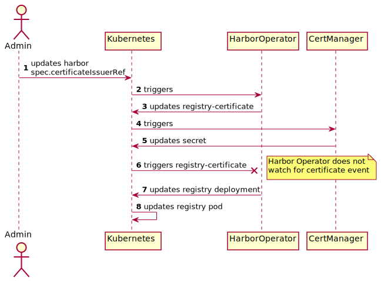

# Certificates

Harbor components required certificates. They are generated thanks to [Certificate resources](https://cert-manager.io/docs/concepts/certificate/).  
To do so, you will need to configure issuer.

## Public

When [deploying the sample](./installation.md#deploy-the-sample), a [self-signed issuer](https://cert-manager.io/docs/configuration/selfsigned/) is created.

This issuer is used to generate the *public certificate*. The [Ingress Controller](https://kubernetes.io/docs/concepts/services-networking/ingress-controllers/) exposes this certificate to end-users for HTTP requests to Harbor.

The public certificate should be trusted by the client.

## WebHook

When [installing the operator](./installation.md#deploy-the-operator), a certificate-authority is generated thanks to the [CA-Injector](https://cert-manager.io/docs/concepts/ca-injector/). This is then used by Kubernetes to trust harbor-operator webhook.

## Internal

Harbor Operator uses the `Issuer` specified in `spec.certificateIssuerRef` to create *registry-certificate* which is used for communication between Core and Registry.

