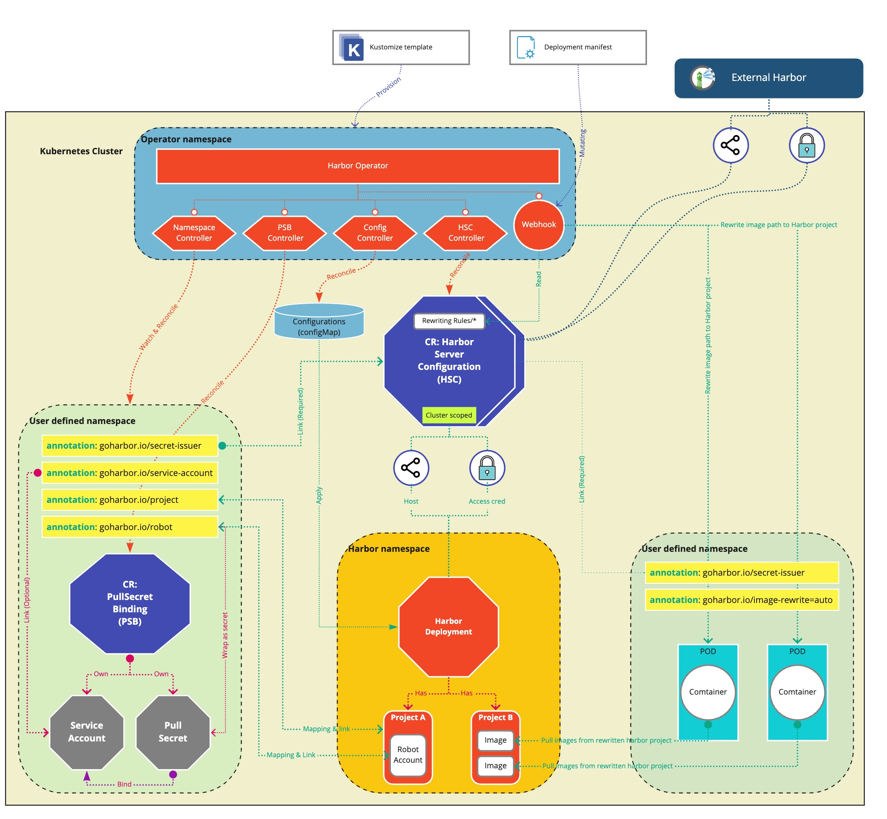

# Day2 Operations

Day2 Operation provides the following features to help users get better experiences of using [Harbor](https://github.com/goharbor/harbor)
or apply some Day2 operations to the Harbor deployed in the Kubernetes cluster:

- [x] **Mapping k8s namespace and harbor project**: make sure there is a relevant project existing at linked Harbor side for the
 specified k8s namespace pulling image from there (bind specified one or create new).
- [x] **Pulling secret auto-injection**: auto create robot account in the corresponding Harbor project and bind it to the
 related service account of the related k8s namespace to avoid explicitly specifying image pulling secret in the
 deployment manifest yaml.
- [x] **image path auto rewriting**: rewrite the pulling path of the matched workload images (e.g: no full repository path specified)
 being deployed in the specified k8s namespace to the corresponding project at the linked Harbor.
- [x] **transparent proxy cache**: rewrite the pulling path of the matched workload images to the proxy cache project of the linked Harbor.
- [x] **apply configuration changes**: update the system configurations of the linked Harbor with Kubernetes way by providing a CRD.
- [ ] certificate population: populate the CA of the linked Harbor instance to the container runtimes of all the cluster workers and let workers trust it to avoid image pulling issues.

## Overall Design

The diagram below shows the overall design of this project:



## Feature

### Day2 configurations

Initially, we configure harbor by means of configmap, but currently we recommend using `HarborConfiguration` CRD to configure harbor, for the configmap method will be deprecated in version 1.2, those who have used and still use configmap will be automatically converted to `HarborConfiguration` CR by the controller, and automatically remove old configmap.
> The harbor configuration items can be found in [harbor swagger](https://github.com/goharbor/harbor/blob/0867a6bfd6f33149f86a7ae8a740f5e1f976cafa/api/v2.0/swagger.yaml#L7990).

#### ConfigMap (deprecated)

First you need to prepare a config map to provide your harbor configurations, apply the config map in the same namespace as harborcluster. In particular, you need to add an annotation (`goharbor.io/configuration: <harbor cluster name>`) to your config map to mark which harborcluster it is acting on.

In addition, in order to protect the password from being displayed directly in the config map, you need to define the password inside the secret, and then specify the name of the secret in the configuration. We currently offer these type of secret configurations fields: `"email_password", "ldap_search_password", "uaa_client_secret", "oidc_client_secret"`.

**ConfigMap example**:

```yaml
apiVersion: v1
kind: Secret
metadata:
  name: secret-sample
  namespace: cluster-sample-ns
type: Opaque
data:
  # the key is same with fields name.
  email_password: YmFyCg==
```

```yaml
apiVersion: v1
kind: ConfigMap
metadata:
  name: test-config
  # namespace same with harborcluster cr namespace.
  namespace: cluster-sample-ns
  annotations:
    # required.
    # if not define the anno, the config map will not work.
    # the key is `goharbor.io/configuration`, and the value is your harborcluster cr name.
    goharbor.io/configuration: harborcluster-sample
data:
  # provide your harbor configuration by yaml format.
  config.yaml: |
    email_ssl: true
    email_password: secret-sample # the value is the name of secret which store the email_password.
```

#### CRD-based HarborConfiguration

**Example of HarborConfiguration**:

```yaml
apiVersion: v1
kind: Secret
metadata:
  name: secret-sample
  namespace: cluster-sample-ns
type: Opaque
data:
  # the key is same with fields name.
  email_password: YmFyCg==
```

```yaml
apiVersion: goharbor.io/v1beta1
kind: HarborConfiguration
metadata:
  name: test-config
  namespace: cluster-sample-ns
spec:
  # your harbor configuration
  configuration:
    email_password: secret-sample
    email_ssl: true
  harborClusterRef: harborcluster-sample
```

After apply your `HarborConfiguration` CR to kubernetes cluster, the controller of `HarborConfiguration` will apply your configuration to harbor instance, you can see the result of configuration from CR status.

```yaml
status:
  lastApplyTime: "2021-06-04T06:07:53Z"
  lastConfiguration:
    configuration:
      email_password: secret-sample
      email_ssl: true
  status: Success
```

### Image rewrite

Image rewrite will rewrite the original image paths to the specified Harbor projects by following the pre-defined rewriting rules via Kubernetes admission control webhook.

A cluster scoped Kubernetes CR named `HarborServerConfiguration` is designed to keep the Harbor server access info by providing the access
host and access key & secret (key and secret should be wrapped into a kubernetes secret) for future referring.
It has a `default` field to define whether this HSC will be applied to all namespaces. There could be only one default HSC.

Rewriting rule is a k-v pair to specify images from which repo should be redirected to which harbor project:
`docker.io=>harborproject1` or `*=>harborproject2`

Here we should pay attention is the key "*" means images from any repo are redirected to harbor project "harborproject2".

Rewriting rules will be defined as a rule list like:

```shell
rules:
  - docker.io=>harborproject1
  - *=>harborproject2
  - quay.io=>harborproject3
```

**Definition location:**

To enforce the rewrite rule to a specific namespace, you need to add a label to the namespace `harbor-day2-webhook-configuration: enabled`.

The rewriting rules can be defined into two places, one is in the HSC spec and another is in a configMap.

Rules in HSC spec are for the whole cluster scope. The rules will be applied to the namespaces selected by the namespace selector of HSC.

The rules defined in the configMap are only visible to the namespace where the configMap is living. Use annotation of namespace rename to `goharbor.io/rewriting-rules` to link the rule configMap.

**The priority:**

Rules in configMap > rules in HSC referenced by ConfigMap > default HSC > "*" rule

For example. images from `docker.io` will be rewritten to 'harborproject1' and images from `quay.io` will be rewritten to 'harborproject3'. The images from `gcr.io` or `ghcr.io` will both be rewritten to 'harborproject2' by following the "*" rule.

**Assumptions:**

- Only 1 HSC as default. (ctrl has to make sure this constraint)
- Default HSC is applicable for all namespaces as the default behavior (except its namespace selector is configured).
- HSC can have a namespace selector to specify its influencing scope.
- Namespace selector is optional. The empty selector means adapting all.

Namespace admin can create a configMap to customize image rewriting for the specified namespace:

**Content of configMap:**

```yaml
hsc: myHscName ## if this ns missing the selector of the specfying HSC, log warnning and no action.
rewriting: on ## or off
rules: -|
  - docker.io=>harborproject1-1
  - *=>harborproject2-1
  - quay.io=>harborproject3-1
```

Add annotation `goharbor.io/rewriting-rules=configMapName` to the namespace to enable the rewriting.

Merging rules: rules defined in configMap has higher priority if conflicts happened.

### Project mapping and secret injection

When doing project mapping and secret injection, an annotation `goharbor.io/project` MUST be added to the specified namespace ( if `goharbor.io/project` is
not set, that means the mapping/injection function is not enabled).

A CR `PullSecretBinding` is created to keep the relationship between Kubernetes resources and Harbor resources.

- the mapping project is recorded in annotation `annotation:goharbor.io/project` of the CR `PullSecretBinding`.
- the linked robot account is recorded in annotation `annotation:goharbor.io/robot` of the CR `PullSecretBinding`.
- make sure the linked robot account is wrapped as a Kubernetes secret and bind with the service account that is specified in the annotation `annotation:goharbor.io/service-account` of the namespace.

- If `goharbor.io/project`=*, then check whether annotation `goharbor.io/secret-issuer` (it should be renamed to `goharbor.io/harbor`) which is pointing to an HSC (It should be provided by the cluster-admin) is set or not. If it is not set, then back off to the default HSC. If there is no default HSC, then an error should be raised. When HSC is ready, create a Harbor project with the same name of the namespace in that HSC and also create a robot account in the newly created Harbor project.  After the robot account is created, the identity of the created robot account should be recorded into the annotation `goharbro.io/robot` (it should be renamed to `goharbor.io/robot-account`).
- If `goharbor.io/project=<project name>`, then the annotation `goharbor.io/robot=<robot_ID>` MUST also be set to a valid robot account that is living in the project representing by the annotation `goharbor.io/project`. The controller has to make sure the robot specified in the annotation can be used to access the project (by accessing API with that robot account).
  - If the specified project name does not exist or the robot account provided does not mismatch, then log the error (should not return an error in the reconcile process)

Then a PSB can be created to track the relationship and bind pull secret to the service account:

- wrap the robot account as a secret
- bind the secret to the service account which is specified by the annotation `goharbor.io/service-account` (this is optional, if it is not set, then use the default service account under the namespace)

## Usages

### HarborServerConfiguration CR

Register your Harbor in a `HarborServerConfiguration` CR:

```yaml
---
apiVersion: v1
kind: Secret
metadata:
  name: mysecret
  namespace: kube-system
type: Opaque
data:
  accessKey: YWRtaW4=
  accessSecret: SGFyYm9yMTIzNDU=
---
apiVersion: goharbor.io/v1beta1
kind: HarborServerConfiguration
metadata:
  name: harborserverconfiguration-sample
spec:
  default: true ## whether it will be default global hsc
  serverURL: https://10.168.167.189 ## https/http is required
  accessCredential:
    namespace: kube-system
    accessSecretRef: mysecret
  version: 2.4.1
  insecure: true
```

Create it:

```shell script
kubectl apply -f hsc.yaml
```

Use the following command to check the `HarborServerConfiguration` CR (short name: `hsc`):

```shell script
kubectl get hsc
```

### Pulling secret injection

Add related annotations and labels to your namespace when enabling secret injection:

```yaml
apiVersion: v1
kind: Namespace
metadata:
  name: sz-namespace1
  annotations:
    goharbor.io/harbor: harborserverconfiguration-sample
    goharbor.io/service-account: default
    goharbor.io/project: "*"
  labels:
    harbor-day2-webhook-configuration: enabled
```

Create it:

```shell script
kubectl apply -f namespace.yaml
```

After the automation is completed, Namespace is updated with newest annotations, a CR `PullSecretBinding` is created:

```shell script
kubectl get namespace sz-namespace1 -oyaml
```

Output details:

```yaml
apiVersion: v1
kind: Namespace
metadata:
  annotations:
    goharbor.io/harbor: harborserverconfiguration-sample
    goharbor.io/project: sz-namespace1-y87uip
    goharbor.io/robot: "8"
    goharbor.io/service-account: default
    kubectl.kubernetes.io/last-applied-configuration: |
      {"apiVersion":"v1","kind":"Namespace","metadata":{"annotations":{"goharbor.io/harbor":"harborserverconfiguration-sample","goharbor.io/project":"*","goharbor.io/service-account":"default"},"labels":{"harbor-day2-webhook-configuration":"enabled","usethisHSC":"ok"},"name":"sz-namespace1"}}
  creationTimestamp: "2021-12-22T21:17:38Z"
  labels:
    harbor-day2-webhook-configuration: enabled
    kubernetes.io/metadata.name: sz-namespace1
    usethisHSC: ok
  name: sz-namespace1
  resourceVersion: "8102"
  uid: 43bd7365-792f-4523-a749-57ea19ace40f
spec:
  finalizers:
  - kubernetes
status:
  phase: Active
```

The related auto-generated data is recorded in the related annotations:

```yaml
annotations:
  goharbor.io/project: sz-namespace1-y87uip
  goharbor.io/robot: "8"
```

```shell script
kubectl get psb -n sz-namespace1

# output
#NAME             HARBOR SERVER                      SERVICE ACCOUNT   STATUS
#binding-txushc   harborserverconfiguration-sample   default           ready
```

Get the details of the psb/binding-xxx:

```shell script
k8s get psb/binding-txushc -n sz-namespace1 -o yaml
```

Output details:

```yaml
apiVersion: goharbor.io/v1beta1
kind: PullSecretBinding
metadata:
  annotations:
    goharbor.io/robot-secret: regsecret-dhrdxd
  creationTimestamp: "2021-12-22T21:33:35Z"
  finalizers:
  - psb.finalizers.resource.goharbor.io
  generation: 1
  name: binding-fqgysg
  namespace: sz-namespace1
  ownerReferences:
  - apiVersion: v1
    blockOwnerDeletion: true
    controller: true
    kind: Namespace
    name: sz-namespace1
    uid: 43bd7365-792f-4523-a749-57ea19ace40f
  resourceVersion: "8107"
  uid: c52f5b10-1cbd-49f6-9731-78e5d3f8dfdb
spec:
  harborServerConfig: harborserverconfiguration-sample
  projectId: "30"
  robotId: "8"
  serviceAccount: default
status:
  status: ready
```

The related auto-generated data is recorded in the related annotations:

```yaml
annotations:
  goharbor.io/robot-secret: regsecret-dhrdxd
```

### Image path rewrite

Add `goharbor.io/rewriting-rules` annotation to target namespace, the value would be the name of ConfigMap that contains the rule. The configMap should be in the same namespace.

Add label `harbor-day2-webhook-configuration: enabled` to the target namespace as well.

If you set namespaceSelector, also add corresponding label to namespace.

```yaml
apiVersion: v1
kind: Namespace
metadata:
  name: sz-namespace1
  annotations:
    goharbor.io/harbor: harborserverconfiguration-sample
    goharbor.io/service-account: default
    goharbor.io/rewriting-rules: cm
  labels:
    usethisHSC: ok
    harbor-day2-webhook-configuration: enabled
```

Rules can be set in ConfigMap, or in the HSC that is referred in `configmap.data.hsc`. `configmap.data.rewriting` needs to be `on`.

Corresponding ConfigMap:

```yaml
apiVersion: v1
kind: ConfigMap
metadata:
  name: cm
  namespace: sz-namespace1
data:
  hsc: harbor2 # hsc that could store the rule
  rewriting: "on" # set to "on" to turn on the rewriting
  rules: | # configMap doesn't support storing nested string
    - docker.io=>highestproject
    - gcr.io=>a
```

Corresponding HSC

To only select specific namespace for apply rules under specific HSC, add `namespaceSelector` to target HSC spec.

```yaml
apiVersion: goharbor.io/v1beta1
kind: HarborServerConfiguration
metadata:
  name: harbor2
spec:
  serverURL: https://10.168.167.189 ## https/http is required
  accessCredential:
    namespace: kube-system
    accessSecretRef: mysecret
  version: 2.4.1
  insecure: true
  rules: ## rules to define to rewrite image path
  - "docker.io=>testharbor"    ## <repo-regex>,<harbor-project>
  namespaceSelector:
    matchLabels:
      usethisHSC: ok
```

As mentioned before, the mutating webhook will rewrite all the images of the deploying pods which has no registry host
prefix to the flowing pattern:

`image:tag => <hsc/hsc-name.[spec.serverURL]>/<psb/binding-xxx.[metadata.annotations[goharbor.io/project]]>/image:tag`

And priority of the rule is

> Rules in configMap > rules in HSC referenced by ConfigMap > default HSC > "*" rule

Try create a pod under namespace `sz-namespace1`

```yaml
apiVersion: v1
kind: Pod
metadata:
  name: webserver
  namespace: sz-namespace1
spec:
  containers:
  - name: webserver  # The name that this container will have.
    image: nginx:latest # The image on which it is based.
    ports:               # The port(s) that will be open.
    - containerPort: 80
```

The pod image path should be changed

```yaml
Image:          demo.goharbor.io/highestproject/library/nginx:latest
```
