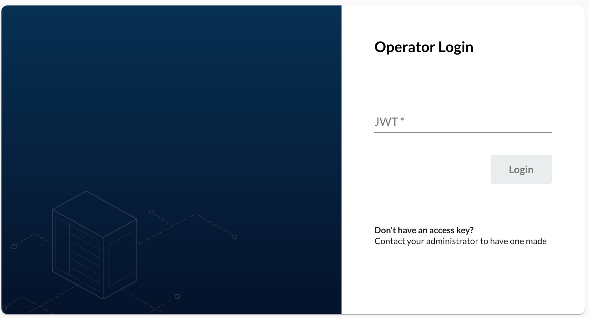
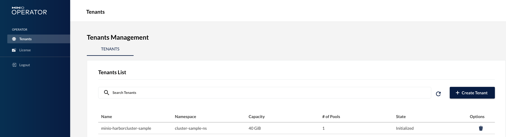

# Enable Minio console

[Minio console](https://github.com/minio/console) is a graphical user interface for you to manage the tenant created by the operator. By default, it is not enabled in the harbor operator [all-in-one](./kustomization-all-in-one.md) kustomization manifest. The doc shown here guides you to enable the Minio console if you have the Minio tenant management needs.

>Notes: If you install Minio operator with its own manifests, the Minio console might be enabled automatically.

## Prerequisites

1. `kubectl` with a proper version(v1.18.6+) is [installed](https://kubernetes.io/docs/tasks/tools/).
1. `kustomize` (optional)with a proper version(v3.8.7+) is [installed](https://kubectl.docs.kubernetes.io/installation/kustomize/).
1. `git` (optional) is [installed](https://git-scm.com/book/en/v2/Getting-Started-Installing-Git).

## Customize the kustomization manifest

First, clone the code from the `harbor-operator` repository.

```shell
git clone https://github.com/goharbor/harbor-operator.git

# Checkout to the specified branch or the specified tag.
# To branch: git checkout <branch-name> e.g.: git checkout release-1.3.0
# To tag: git checkout tags/<tag> -b <branch-name> e.g: git checkout tags/v1.3.0 -b tag-v1.3.0
```

Then open the [all-in-one](./kustomization-all-in-one.md) kustomization manifest and locate the `patchesStrategicMerge` section. Comment the patch `- patch/delete-minio-console.yaml`.

```yaml
# If you have to override the image path, uncomment this patch and also change the image paths in the patch/image-source.yaml file.
# Then rebuild.
patchesStrategicMerge:
#   - patch/image-source.yaml
#  - patch/delete-minio-console.yaml
  - patch/delete-duplicated-ns.yaml
  - patch/pg-configmap.yaml
```

As the resource manifests are not stored in the codebase, then you need to run the following command to generate the related resource manifests before using `kustomize` to build your customized operator deployment manifest.

```shell
make manifests
```

Run `kustomize` command to generate your customized operator deployment manifest.

```shell
kustomize build manifest/cluster -o myCustom.yaml
```

## Deploy Minio console

Apply the customized deployment manifest to your Kubernetes cluster.

```shell
kubectl apply -f myCustom.yaml
```

Of course, if you're willing to, you can directly apply the deployment via kustomization manifest.

```shell
kubectl apply -k manifests/cluster

# OR
# kustomize build manifest/cluster | kubectl apply -f -
```

After a short while, the console pod will be ready then.

```shell
# Check console pod status
kubectl get pods --selector=app=console -n harbor-operator-ns

## Output
# NAME                      READY   STATUS    RESTARTS   AGE
# console-97c5cdc46-q6ptc   1/1     Running   0          18h
```

## Expose the Minio console service

To access the console service outside your Kubernetes cluster, you need to expose the Minio console service.

A simple way, expose it via port forward.

```shell
kubectl port-forward --address 10.10.1.10 service/console -n harbor-operator-ns 29090:9090
```

Alternatively, create an ingress.
e.g.:

```yaml
apiVersion: networking.k8s.io/v1
kind: Ingress
metadata:
  name: minio-console
  namespace: harbor-operator-ns
spec:
  rules:
  - host: minio-console.10.10.1.10.xip.io
    http:
      paths:
      - backend:
          service:
            name: console
            port:
              number: 9090
        path: /
        pathType: Prefix
status:
  loadBalancer:
    ingress:
    - hostname: localhost
```

## Access the Minio console

Open browser and navigate to the expose host of the Minio console service, e.g.: `https://minio-console.10.10.1.10.xip.io`. You'll see the login page.



Get the JWT token from your service account.

```shell
kubectl -n harbor-operator-ns get secret $(kubectl -n harbor-operator-ns get serviceaccount console-sa -o jsonpath="{.secrets[0].name}") -o jsonpath="{.data.token}" | base64 --decode
```

Input the token got from the above command in the login page and you'll be navigated to the dashboard page.

All the tenants created are listed.



Click any tenant to see their basic information.

>NOTES: The available functionalities of the Minio console will be different based on the license subscription plan which is irrelevant with Harbor operator.
