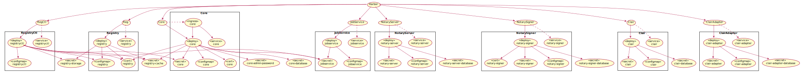

# Kubernetes resources dependency

Few Kubernetes resources require some other resources to be created.

## Main root causes

*Pods* with *ConfigMaps* and *Secret* as volume.

## Dependency

```plantuml:resources-dependency
@startuml
(clair-database) as Clair.DB << secret >>
rectangle Clair {
    (clair) as Clair.Depl   << deploy >>
    (clair) as Clair.Secret << secret >>
    (clair) as Clair.Conf   << configmap >>
    (clair) as Clair.Serv   << service >>
}

(clair-adapter-database) as ClairAdap.DB << secret >>
rectangle ClairAdapter {
    (clair-adapter) as ClairAdap.Depl   << deploy >>
    (clair-adapter) as ClairAdap.Secret << secret >>
    (clair-adapter) as ClairAdap.Conf   << configmap >>
    (clair-adapter) as ClairAdap.Serv   << service >>
}

(core-admin-password) as Core.Admin << secret >>
(core-database)       as Core.DB    << secret >>
rectangle Core {
    (core) as Core.Depl   << deploy >>
    (core) as Core.Secret << secret >>
    (core) as Core.Conf   << configmap >>
    (core) as Core.Ing    << ingress >>
    (core) as Core.Serv   << service >>
    (core) as Core.Cert   << cert >>
}

rectangle JobService {
    (jobservice) as JS.Depl   << deploy >>
    (jobservice) as JS.Conf   << configmap >>
    (jobservice) as JS.Secret << secret >>
    (jobservice) as JS.Serv   << service >>
}

(notary-server-database) as NotSer.DB << secret >>
rectangle NotaryServer {
    (notary-server) as NotSer.Depl   << deploy >>
    (notary-server) as NotSer.Secret << secret >>
    (notary-server) as NotSer.Conf   << configmap >>
    (notary-server) as NotSer.Serv   << service >>
}

(notary-signer-database) as NotSig.DB << secret >>
rectangle NotarySigner {
    (notary-signer) as NotSig.Depl   << deploy >>
    (notary-signer) as NotSig.Secret << secret >>
    (notary-signer) as NotSig.Conf   << configmap >>
    (notary-signer) as NotSig.Serv   << service >>
    (notary-signer) as NotSig.Cert   << cert >>
}

(registry-storage) as Reg.Back  << secret >>
(registry-cache)   as Reg.Cache << secret >>
rectangle Registry {
    (registry) as Reg.Depl << deploy >>
    (registry) as Reg.Conf << configmap >>
    (registry) as Reg.Cert << cert >>
    (registry) as Reg.Serv << service >>
}

(registry-storage) as Reg.Back  << secret >>
(registry-cache)   as Reg.Cache << secret >>
rectangle RegistryCtl {
    (registryctl) as RegCtl.Depl << deploy >>
    (registryctl) as RegCtl.Conf << configmap >>
    (registryctl) as RegCtl.Serv << service >>
}

(Harbor) --> (Clair)
(Clair) .> Clair.Serv
(Clair) --> Clair.Depl
Clair.Depl --> Clair.DB
Clair.Depl --> Clair.Conf
Clair.Depl --> Clair.Secret

(Harbor) --> (ClairAdapter)
(ClairAdapter) .> ClairAdap.Serv
(ClairAdapter) --> ClairAdap.Depl
ClairAdap.Depl --> ClairAdap.DB
ClairAdap.Depl --> ClairAdap.Conf
ClairAdap.Depl --> ClairAdap.Secret


(Harbor) --> (Core)
(Core) .> Core.Ing
(Core) --> Core.Depl
Core.Ing  --> Core.Depl
Core.Ing  --> Core.Serv
Core.Depl --> Core.Admin
Core.Depl --> Core.DB
Core.Depl --> Reg.Cache
Core.Depl --> Core.Cert
Core.Depl --> Core.Conf
Core.Depl --> Core.Secret
Core.Depl --> JS.Secret
Core.Depl --> Reg.Cert

(Harbor) --> (JobService)
(JobService) .> JS.Serv
(JobService) --> JS.Depl
JS.Depl --> JS.Conf
JS.Depl --> JS.Secret

(Harbor) --> (NotaryServer)
(NotaryServer) .> NotSer.Serv
(NotaryServer) --> NotSer.Depl
NotSer.Depl --> NotSer.DB
NotSer.Depl --> NotSer.Conf
NotSer.Depl --> NotSer.Secret

(Harbor) --> (NotarySigner)
(NotarySigner) .> NotSig.Serv
(NotarySigner) --> NotSig.Depl
NotSig.Depl --> NotSig.DB
NotSig.Depl --> NotSig.Conf
NotSig.Depl --> NotSig.Secret
NotSig.Depl --> NotSig.Cert

(Harbor) --> (Reg)
(Reg) .> Reg.Serv
(Reg) --> Reg.Depl
Reg.Depl --> Reg.Back
Reg.Depl --> Reg.Cache
Reg.Depl --> Reg.Cert
Reg.Depl --> Reg.Conf

(Harbor) --> (RegCtl)
(RegCtl) .> RegCtl.Serv
(RegCtl) --> RegCtl.Depl
RegCtl.Depl --> Reg.Back
RegCtl.Depl --> Reg.Cache
RegCtl.Depl --> Core.Secret
RegCtl.Depl --> JS.Secret
RegCtl.Depl --> Reg.Cert
RegCtl.Depl --> Reg.Conf
RegCtl.Depl --> RegCtl.Conf
@enduml
```
